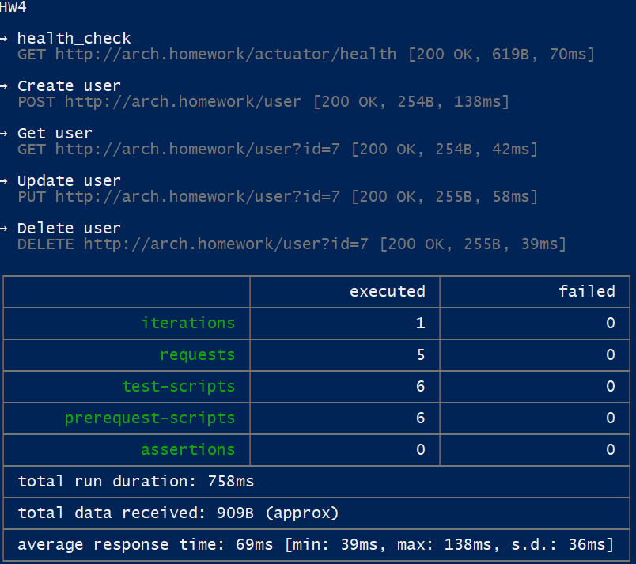

## Инфраструктурные паттерны

### Сделать простейший RESTful CRUD по созданию, удалению, просмотру и обновлению пользователей. 
Пример API - https://app.swaggerhub.com/apis/otus55/users/1.0.0


- Добавить базу данных для приложения.
- Конфигурация приложения должна хранится в Configmaps.
- Доступы к БД должны храниться в Secrets.
- Первоначальные миграции должны быть оформлены в качестве Job-ы, если это требуется.
- Ingress-ы должны также вести на url arch.homework/ (как и в прошлом задании)

### На выходе должны быть предоставлена

- ссылка на директорию в github, где находится директория с манифестами кубернетеса (в виде pull request).
- инструкция по запуску приложения.
- команда установки БД из helm, вместе с файлом values.yaml.
- команда применения первоначальных миграций
- команда kubectl apply -f, которая запускает в правильном порядке манифесты кубернетеса
- Postman коллекция, в которой будут представлены примеры запросов к сервису на создание, получение, изменение и удаление пользователя. Важно: в postman коллекции использовать базовый url - arch.homework.
- Проверить корректность работы приложения используя созданную коллекцию newman run коллекция_постман и приложить скриншот/вывод исполнения корректной работы

##### Задание со звездочкой:
- Добавить шаблонизацию приложения в helm чартах

### Решение
Установка nginx в неймспейс ng
```
helm repo add ingress-nginx https://kubernetes.github.io/ingress-nginx/
helm repo update
kubectl create namespace ng
helm install nginx ingress-nginx/ingress-nginx --namespace ng -f k8s/nginx-ingress.yaml
```

Установка приложения
```
helm install users-release .\users-service\
```

Проверка
```
minikube tunnel

newman run .\.postman\HW4.postman_collection.json --env-var "baseURL=http://arch.homework"
```
[Postman коллекция HW4](./.postman/HW4.postman_collection.json)

